# Traccia — AI screen recorder

🇬🇧 English · [🇮🇹 Italiano](README.it.md)

Record your screen to explain something **to an AI**, not just to a person.

<p align="center">
  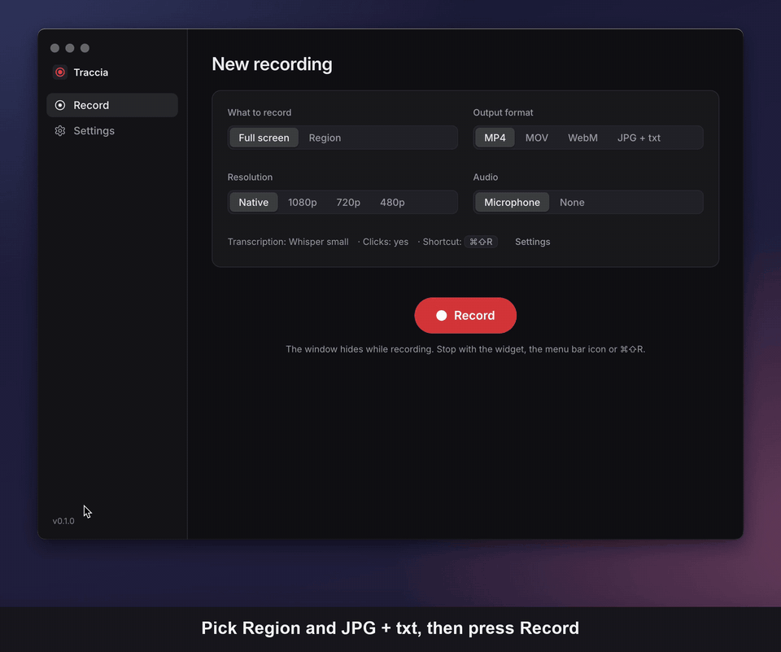
</p>
<p align="center"><sub>Pick <em>Region</em> and <em>JPG + txt</em> → drag the area → record while talking → stop from the widget → frames + <code>recording.txt</code> are ready. <a href="docs/demo.mp4">MP4 version</a>.</sub></p>

Every recording produces, in the same folder:

- the video (`recording.mp4` / `.mov` / `.webm`) **or** a JPG sequence at a few frames per second (`frames/`);
- `recording.txt`: a timeline a model can read, with the **mouse clicks** (and their coordinates) and the **voice transcript** (Whisper, running locally);
- `recording-raw.txt`: the same timeline plus the **pointer movement** (position sampled at a configurable rate) — heavier, for when the path of the pointer matters;
- `recording.json`: the same data in full (cursor at 120 Hz, geometry, etc.);
- `PROMPT.md`: the instructions for the AI — what the folder contains (with absolute paths), how to read the timeline and what to do with it. When the recording is done, **Copy prompt for AI** puts `Read the file …/PROMPT.md and follow its instructions.` in the clipboard: paste it into Claude Code, Cursor or any agent that can read files and it finds everything on its own.

The `recording.txt` produced by the demo above (JPG mode, 2 fps):

```
# Traccia — recorded on 9/17/2026, 9:48:49 PM
# Frames: folder frames/ (1416x1060, 2 fps, 10 frames; 17 identical frames skipped), duration 00:13.094
# Audio: microphone, transcribed with Whisper base (language: en)
# Cursor: only mouse clicks are listed (coordinates in image pixels, origin at the top-left corner); the full pointer movement is in recording-raw.txt
#
# Line format:
#   mm:ss.mmm frame <file>                 image captured at that instant
#   mm:ss.mmm click left|right|middle X,Y  mouse click
#   [mm:ss.mmm → mm:ss.mmm] text          transcribed speech

00:00.000 frame frames/frame_00001.jpg
[00:00.000 → 00:04.000] Let me show you how to turn on the VPN for this project.
00:02.500 frame frames/frame_00002.jpg
00:03.000 frame frames/frame_00003.jpg
00:03.500 frame frames/frame_00004.jpg
[00:04.000 → 00:10.000] I open a network tab, enable the VPN toggle, and save the changes.
00:05.500 frame frames/frame_00005.jpg
00:06.000 frame frames/frame_00006.jpg
00:08.000 frame frames/frame_00007.jpg
00:08.500 frame frames/frame_00008.jpg
00:12.000 frame frames/frame_00009.jpg
00:12.500 frame frames/frame_00010.jpg
```

<p align="center">
  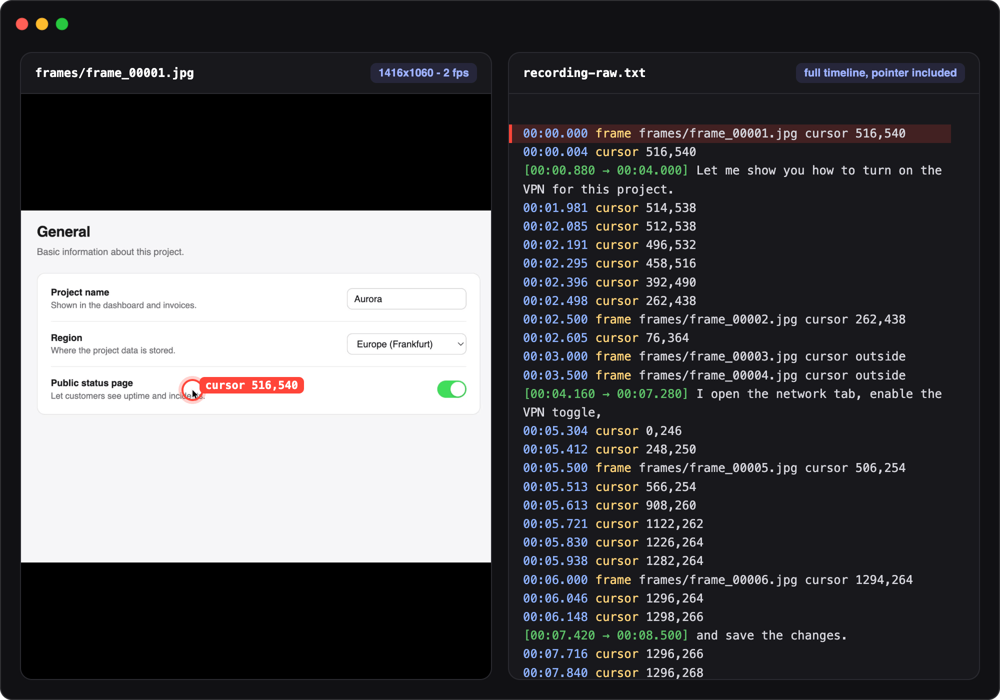
</p>
<p align="center"><sub>The first frame next to its timeline. Coordinates in the text (clicks in <code>recording.txt</code>, pointer positions too in <code>recording-raw.txt</code>) are pixel positions in the image.</sub></p>

## Features

- Full screen or a region selected by dragging (macOS style).
- Output as MP4, MOV, WebM or **JPG + txt** with configurable frame rate (1, 2, 4…).
- Native (Retina), 1080p, 720p or 480p resolution.
- Microphone recording and transcription with **Whisper running locally** (models can be downloaded and deleted from the app; nothing leaves your computer).
- Models already present in the Hugging Face cache (`~/.cache/huggingface/hub`, `HF_HOME`, `HF_HUB_CACHE`) are imported with hard links instead of being downloaded again.
- **Word-level timestamps**: speech is split into short phrases that interleave with the clicks, and every click line also carries the words being spoken at that moment (`click left 820,352 "now I click Save"`).
- Pointer sampled at 120 Hz and global mouse clicks (with the Accessibility permission).
- In JPG mode, frames identical to the previous one (cursor excluded) are skipped.
- `PROMPT.md` in every recording folder and a one-click **Copy prompt for AI** (also in the recent recordings list and in the menu bar).
- Floating widget with timer and Stop (excluded from the capture). Optional global shortcuts, off by default: the macOS screenshot keys (⇧⌘5 full screen, ⇧⌘4 region), alternative ones (⌃⌥⌘5, ⌃⌥⌘4) or your own; either one also stops.
- Menu bar icon with quick actions: record screen/region, stop, format, resolution, fps, microphone, transcription, clicks, recent recordings.
- Open at login (menu-bar-only start), optional Dock icon.
- Interface in English and Italian.

## Screenshots

### First run

A four-step wizard: language, macOS permissions, Whisper model, output folder.

<p align="center">
  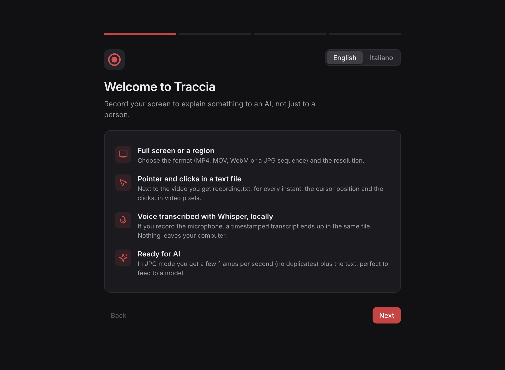
  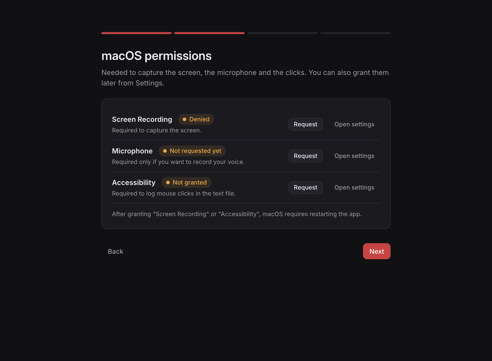
</p>
<p align="center">
  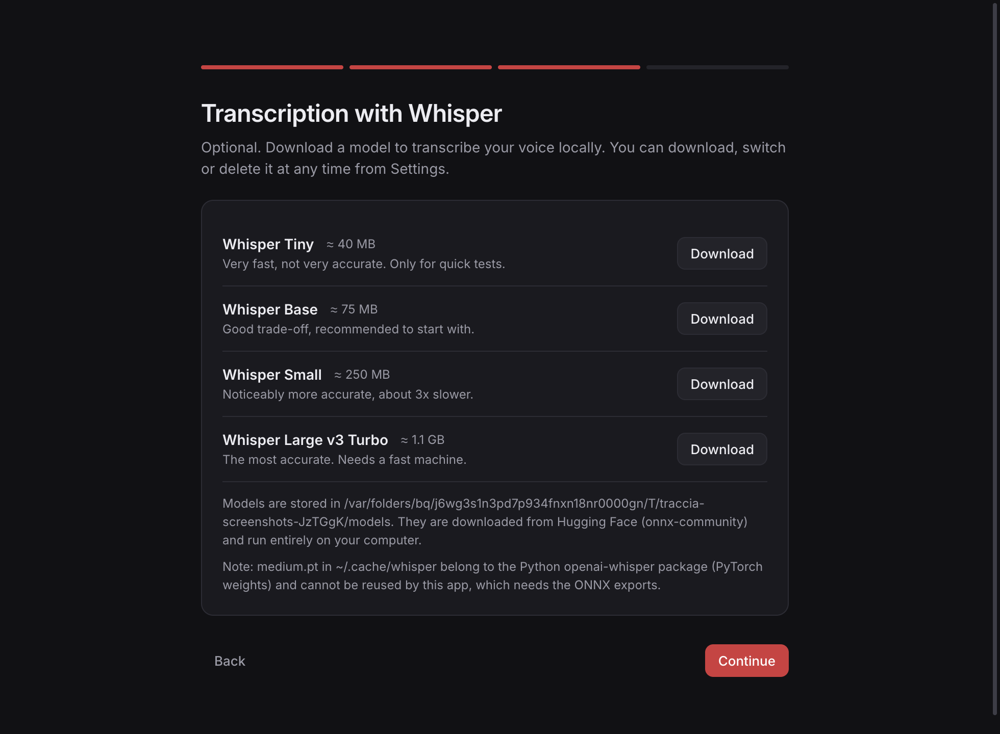
  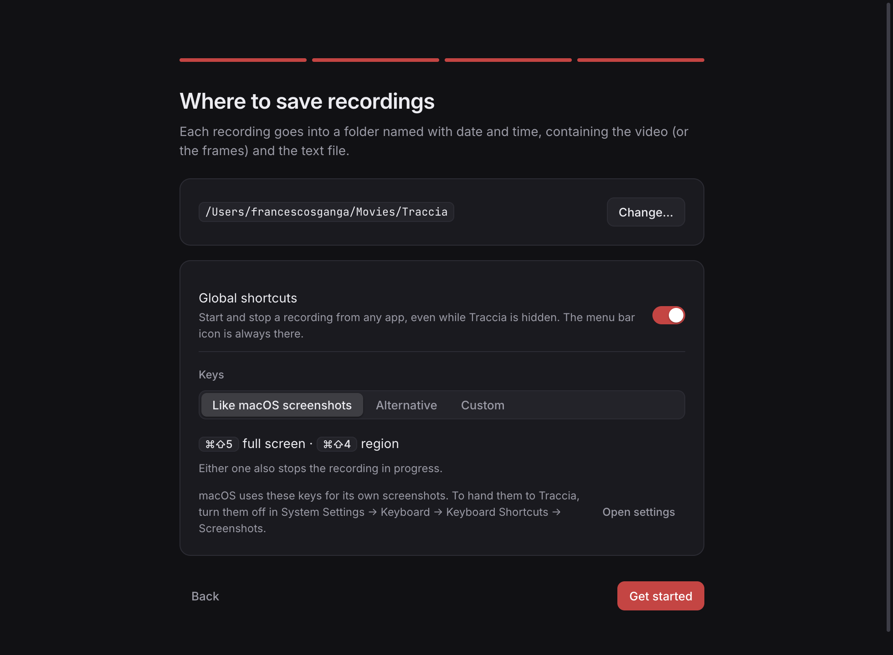
</p>

### Recording

Choose what to capture, the format and the resolution, then record. Dragging a region works like the macOS screenshot tool; while recording the main window hides and a floating widget with the timer stays on top (it is excluded from the capture).

<p align="center">
  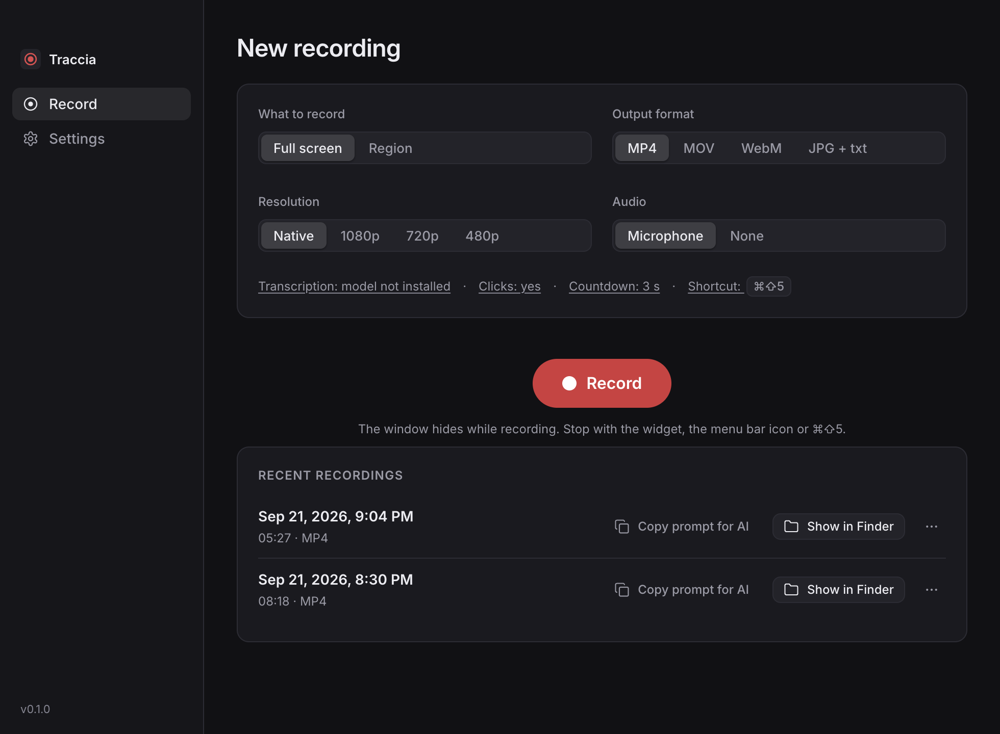
  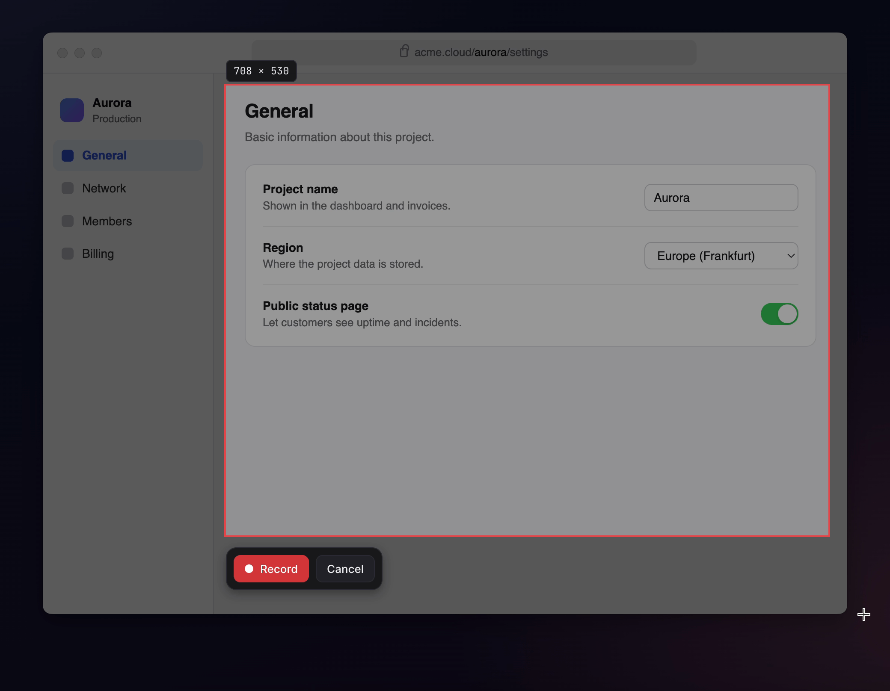
</p>
<p align="center">
  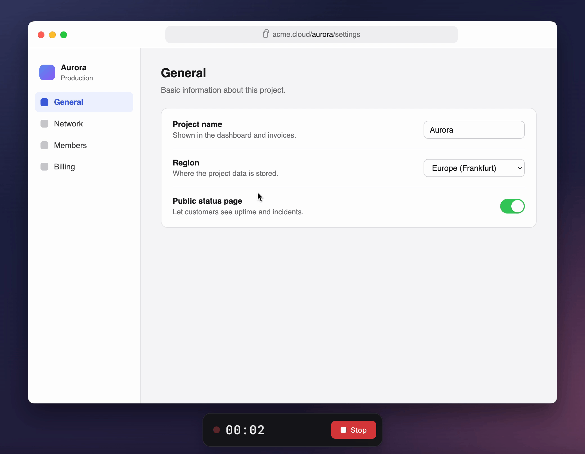
  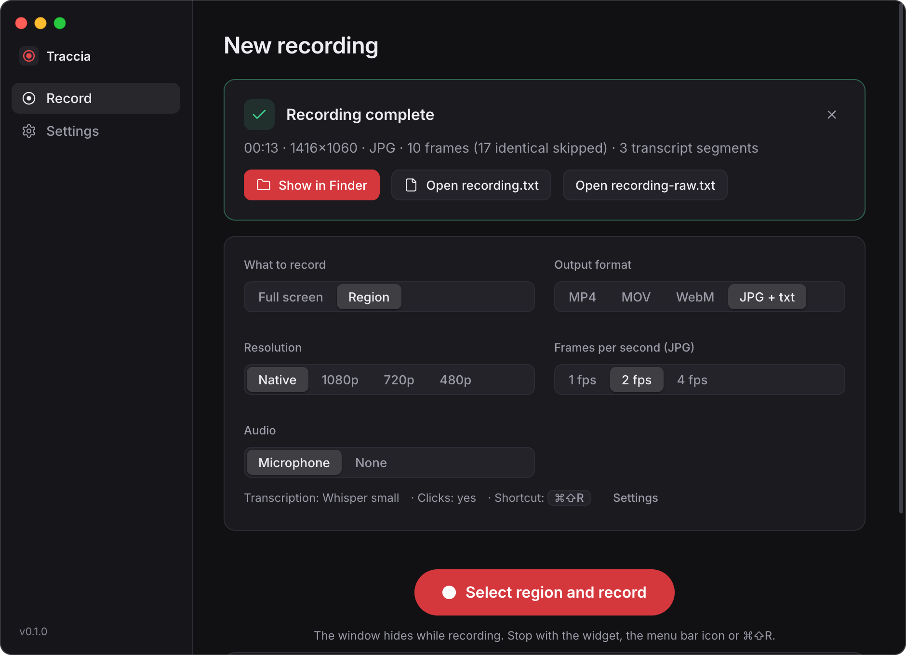
</p>
<p align="center">
  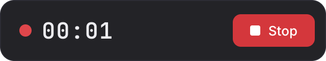
  &nbsp;&nbsp;&nbsp;
  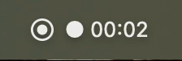
</p>

### Settings

<p align="center">
  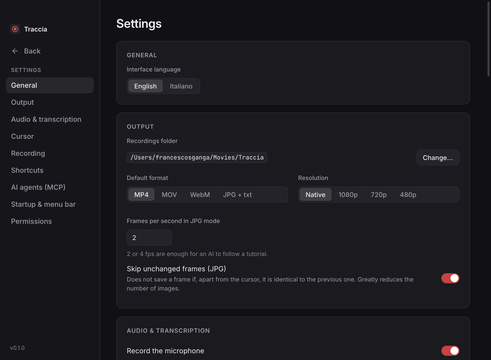
  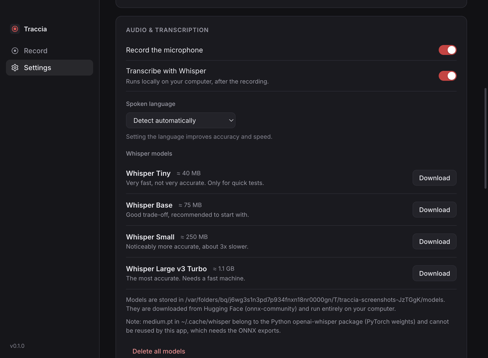
</p>
<p align="center">
  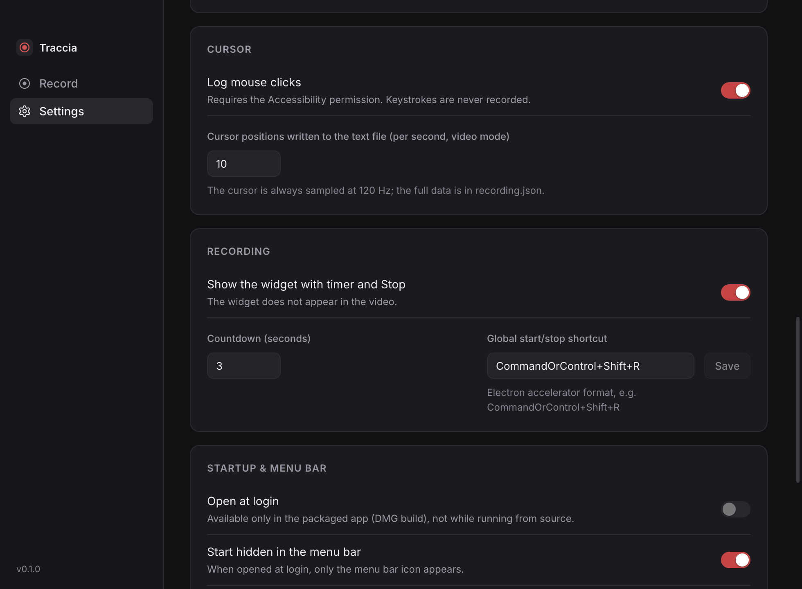
  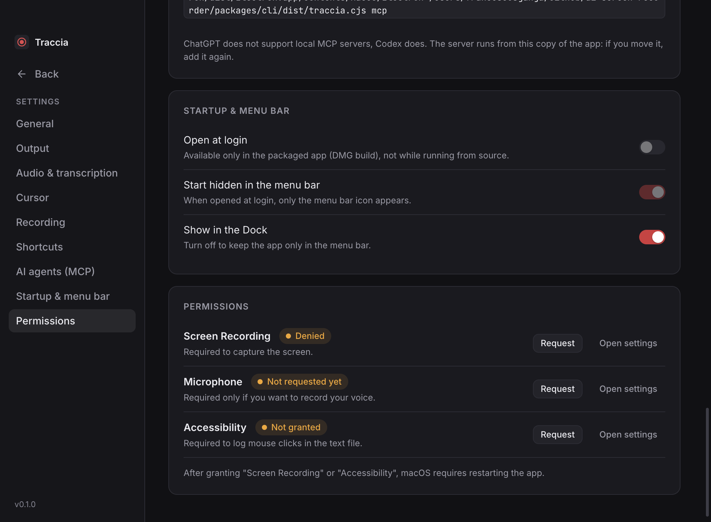
</p>

## Install

Download the DMG for your Mac from the [Releases page](../../releases/latest): `arm64` for Apple Silicon (M1 and later), `x64` for Intel. Open it and drag **Traccia** into Applications.

The app is not signed with an Apple developer certificate, so on first launch macOS refuses to open it ("Apple could not verify…"). Two ways to get past that:

- **System Settings → Privacy & Security**, scroll down to the message about Traccia and click **Open Anyway** (only needed the first time);
- or remove the quarantine flag from the terminal:

```bash
xattr -cr "/Applications/Traccia.app"
```

If you enable the shortcuts with the macOS screenshot keys (⇧⌘5, ⇧⌘4), macOS keeps handling them until you turn them off in **System Settings → Keyboard → Keyboard Shortcuts → Screenshots**; the app links to that pane. The alternative keys need no change.

## Development

The code was written by me with heavy use of Claude Code. Every line has been read and understood; the architecture, the output format and the trade-offs are mine. Issues and PRs are welcome, and I answer them personally.

Requires Node 20+.

```bash
npm install
npm run dev        # start the app with hot reload
npm run build      # production build into out/
npm run dist       # create the DMG in dist/ (unsigned)
npm run typecheck
```

Quick end-to-end test without clicking through the UI (records 6 seconds of the primary display, then quits):

```bash
npm run build && TRACCIA_AUTOTEST=6 npx electron .
```

Useful variables: `TRACCIA_AUTOTEST_MODE=region` with `TRACCIA_AUTOTEST_REGION=x,y,w,h` (in points, relative to the display); `TRACCIA_FFMPEG=/path/to/ffmpeg` to use a different ffmpeg than the bundled one.

UI screenshots for this README (wizard, home, settings) are regenerated with a throwaway profile and no screen-capture permission:

```bash
npm run build && TRACCIA_SCREENSHOTS=docs/screenshots npx electron .
```

The design tokens and component rules live in [docs/design-system.md](docs/design-system.md).

### macOS permissions in development

In development the app runs inside `node_modules/electron/dist/Electron.app`, so macOS asks for permissions for "Electron": Screen Recording (required), Microphone, Accessibility (for clicks). After granting Screen Recording or Accessibility the app must be restarted.

### Releases

Releases are built by GitHub Actions ([release.yml](.github/workflows/release.yml)): pushing a `v*` tag builds the arm64 and x64 DMGs on macOS runners and attaches them to a draft release, to be reviewed and published from the Releases page.

```bash
npm version patch   # or minor / major: bumps package.json and creates the tag
git push --follow-tags
```

## How it works

| Part | Technology |
|---|---|
| Video capture | `getDisplayMedia` + `MediaRecorder` (H.264 when available) in the renderer, chunks written to disk by the main process |
| Cursor | `screen.getCursorScreenPoint()` at 120 Hz in the main process |
| Clicks | [`uiohook-napi`](https://github.com/SnosMe/uiohook-napi) |
| Conversion, crop, scaling, JPG extraction | [`ffmpeg-static`](https://github.com/eugeneware/ffmpeg-static) (hardware `h264_videotoolbox` encoder on macOS) |
| Transcription | OpenAI Whisper models in ONNX format (the `_timestamped` exports from [onnx-community](https://huggingface.co/onnx-community), which provide word-level timestamps) run by [`@huggingface/transformers`](https://github.com/huggingface/transformers.js) in a utility process |
| UI | Electron + Vite + React + TypeScript |

Layout: `src/main` (main process: recording session, ffmpeg, Whisper, timeline), `src/preload` (IPC bridge), `src/renderer` (UI, capture engine, region overlay, widget), `src/shared` (types and translations).

Translations live in `src/shared/i18n.ts`; adding a language means adding a dictionary there.

## Roadmap

- A CLI and an MCP server, so agents can read recordings and start/stop a recording without the app in front.
- A small post-recording editor (trim, cut sections) that keeps the timeline in sync.
- System audio on macOS.
- Windows support.
- `whisper.cpp` backend on Apple Silicon.
- More interface languages.

## License

MIT — see [LICENSE](LICENSE).
